# Deploying a Web Solution with Wordpress


## Project Overview: 

This project aims to deploy a web solution using WordPress on Ubuntu servers hosted on Amazon EC2 instances. It involves setting up two EC2 instances, configuring block devices, creating logical volumes, installing WordPress, and configuring a MySQL database server.

## Prerequisites:

- Access to an AWS account with permissions to create EC2 instances and manage security groups.

- Basic familiarity with the Linux command line.

- Understanding of web server configurations and WordPress installation.

## Step-by-Step Implementation:

### Step 1 - Launch and Configure EC2 Instances:

Create two Ubuntu EC2 instances


Configure Security group to allow inbound traffic on ports 22 (SSH) and 80 (HTTP) for the web server, and port 3306 (MySQL) for the database server.

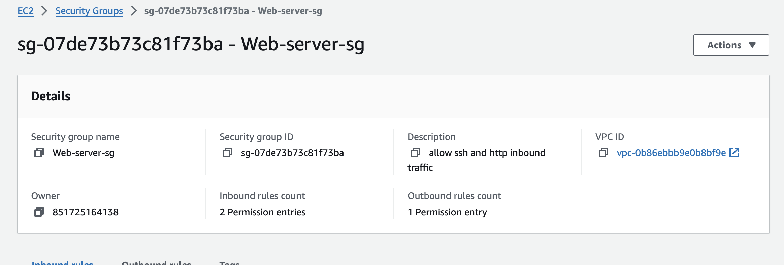

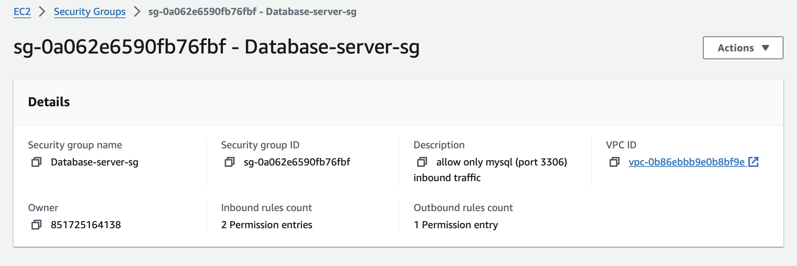

### Step 2 - Create and Attach EBS Volumes:

In the AWS Management Console, create three EBS volumes of 10 GiB each in the same AZ as the web server instance.

Attach these volumes to the web server instance.


### Step 3 - Verify EBS Volume Attachment (Web Server):

Connect to the web server instance

Use the command below to list all block devices and verify that the attached volumes (nvme1n1, nvme2n1, nvme3n1) are present.

```
lsblk
```


### Step 4 - Partition EBS Volumes (Web Server):

Create a single partition on each of the 3 disks using the `gdisk`  command

```
sudo gdisk /dev/nvme1n1
```
```
sudo gdisk /dev/nvme2n1
```
```
sudo gdisk /dev/nvme3n1
```

- Refer to the gdisk documentation for detailed usage:	[gdisk documentation](https://linux.die.net/man/8/gdisk).

Follow the interactive prompts to create partitions for each EBS volume, ensuring sufficient space for Wordpress installation.


Verify the partitions

```
lsblk
```
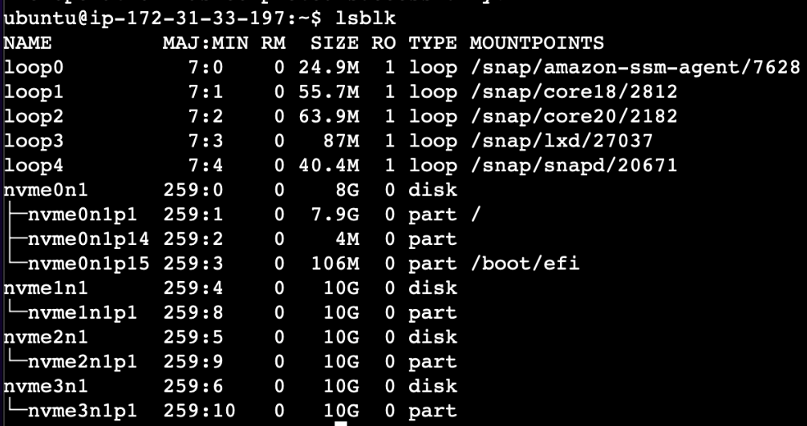

### Step 5 - Install LVM Package (Web Server):

Install the Logical Volume Manager (LVM) package using the following command:

```
sudo apt update
```
```

sudo apt install lvm2 -y
```


### Step 6 - Check Available Partitions (Web Server):

Use the command below to list all available physical partitions for LVM management.

```
sudo lvmdiskscan
```
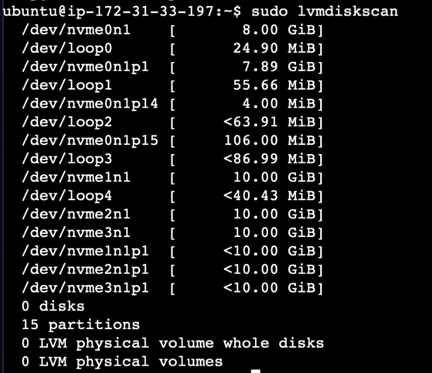

### Step 7 - Create Physical Volumes (Web Server):

- Use the `sudo pvcreate` command to mark each of the newly created partitions as physical volumes (PVs) that LVM can use.

```
sudo pvcreate /dev/nvme1n1p1 /dev/nvme2n1p1 /dev/nvme3n1p1
```

Verify the physical volumes by running the comand below. which will list all available PVs.

```
sudo pvs
```


### Step 8 - Create Volume Group (Web Server):

Use the `sudo vgcreate` command to create a volume group (VG) named webdata-vg that will combine the three PVs.

```
sudo vgcreate webdata-vg /dev/nvme1n1p1 /dev/nvme2n1p1 /dev/nvme3n1p1
```

Verify the volume group created using:

```
sudo vgs
```


### Step 9 -  Create Logical Volumes (Web Server):

Use the `sudo lvcreate` command to create two logical volumes (LVs) within the webdata-vg volume group:
1. apps-lv: This will store your WordPress application files and allocate half of the total available space in the volume group.

2. logs-lv: This will store log data and use the remaining space.

```
sudo lvcreate -n apps-lv -L 15G webdata-vg  
```
```
sudo lvcreate -n logs-lv -L 14G webdata-vg
```
_Note - Adjust -L based on your needs_

Verify the Logical Volumes created by listing all logical volumes using:

```
sudo lvs
```


### Step 10 - Format Logical Volumes (Web Server):

Use the `sudo mkfs.ext4 `command to format the logical volumes with the ext4 filesystem:

```
sudo mkfs.ext4 /dev/webdata-vg/apps-lv
```
```
sudo mkfs.ext4 /dev/webdata-vg/logs-lv
```
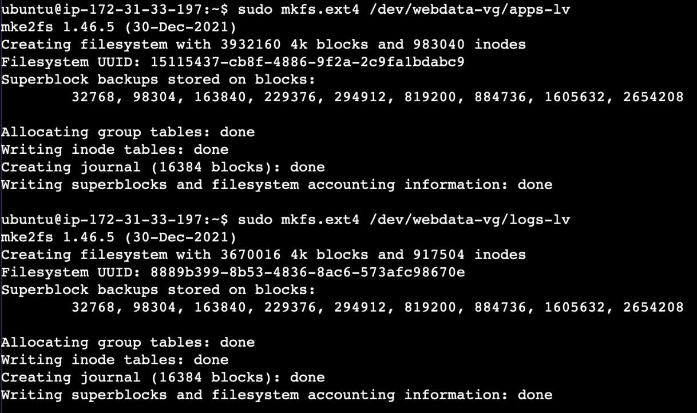

### Step 11 - Create Mount Points and Mount Logical Volumes (Web Server):

Create directories to serve as mount points for the logical volumes:

```
sudo mkdir -p /var/www/html  
```
_For WordPress files_

```
sudo mkdir -p /home/recovery/logs  
```
_For logs backups_

Mount the apps-lv logical volume to the /var/www/html directory, where your websites files will reside:

```
sudo mount /dev/webdata-vg/apps-lv /var/www/html/
```

Before mounting the logs-lv volume for log files:
Use rsync to back up existing log files from `/var/log` to a secure location like `/home/recovery/logs`:

```
sudo rsync -av /var/log/. /home/recovery/logs/
```
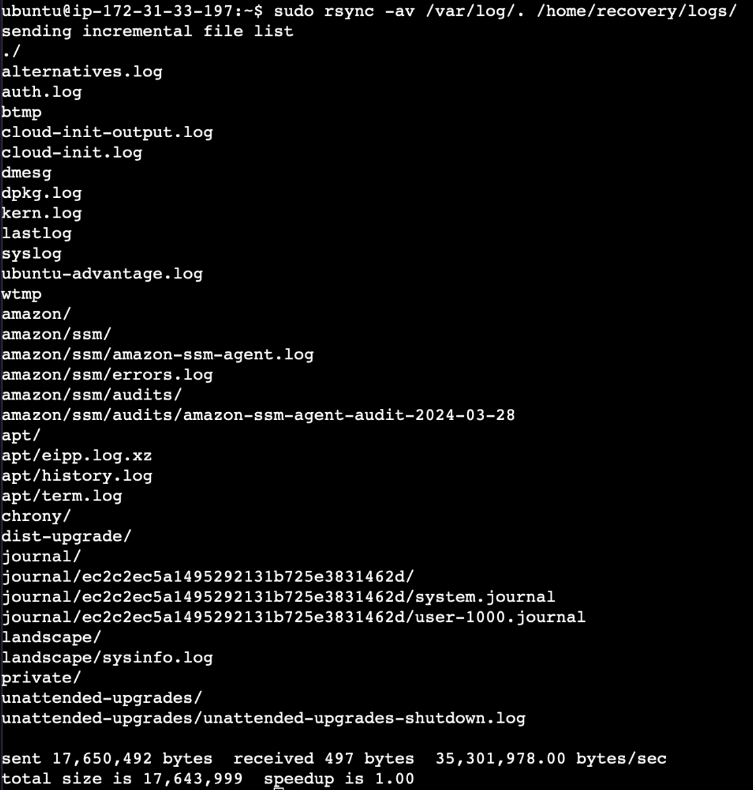

Once done, mount /var/log on logs-lv logical volume
```
sudo mount /dev/webdata-vg/logs-lv /var/log
```

Now restore the previously backed-up logs from `/home/recovery/logs` back to `/var/log`:

```
sudo rsync -av /home/recovery/logs/. /var/log

```
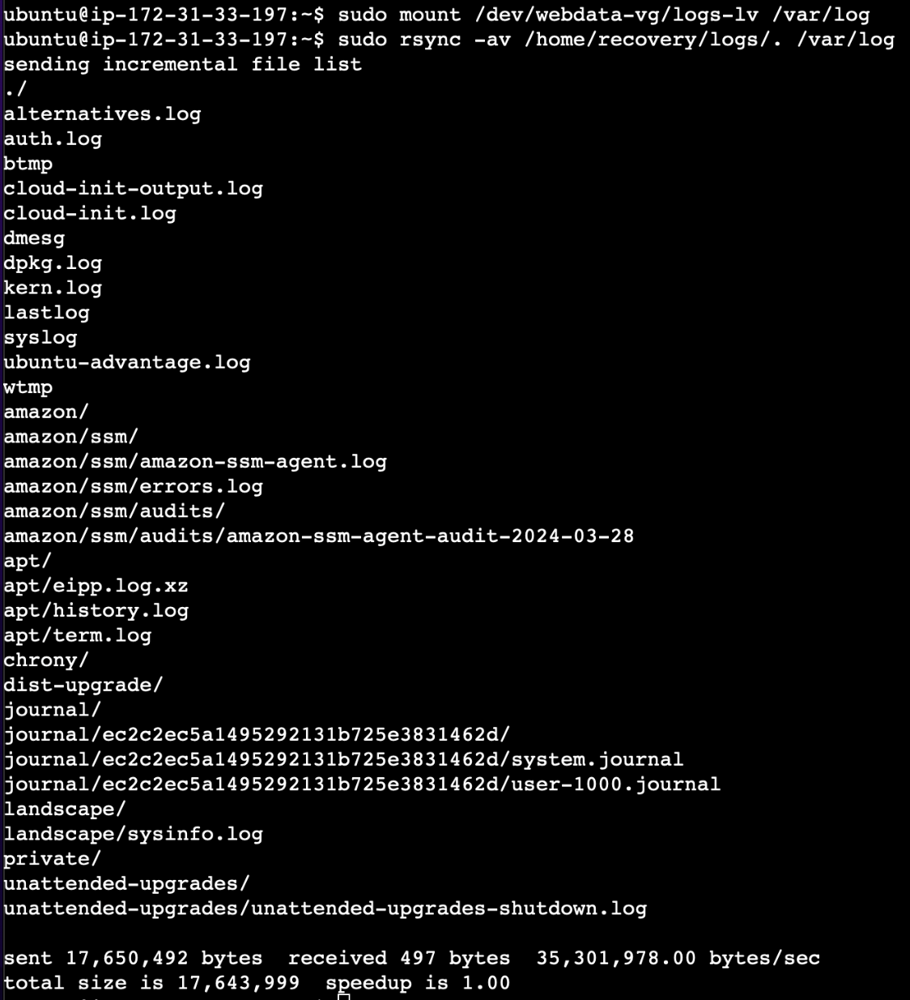

### Step 12 - Update fstab File (Web Server):

Edit the `/etc/fstab` file using vi or another preferred text editor to ensure the mount points persist across reboots:

Extract the UUID of the device using

```
sudo blkid
```

Add entries for the logical volumes, replacing UUID with your device UUID.
```
sudo nano /etc/fstab
```


Save and close the fastab file

Verify that the mount configurations work as expected:

```
sudo mount -a
```
If you don't get any feedback this means the configuration is okay.

Restart the system service to pick up changes:

```
sudo systemctl daemon-reload
```

### Step 13 - Database Server Setup:

Repeat steps 2-12 i.e (creating and attaching EBS volumes, partitioning, LVM configuration, mounting) on the database server instance, but with the following modifications:
- Mount the logical volume to a directory like /db instead of /var/www/html and db-lv instead of apps-lv.

- There's no need to create a separate volume for logs on the database server.

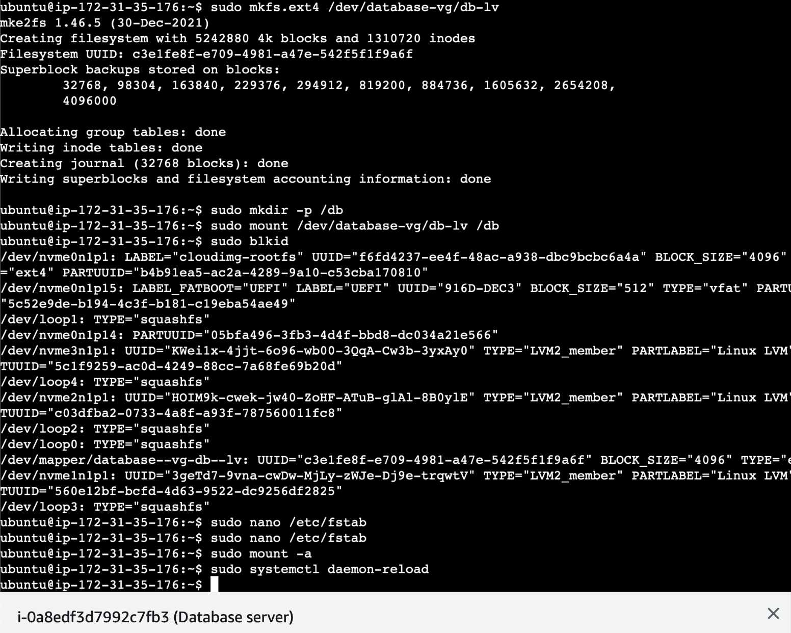


### Step 14 - Install and Configure MySQL (Database Server):

Update package lists:

```
sudo apt update
```

Install MySQL server:

```
sudo apt install mysql-server -y
```

Start and enable the MySQL service:

```
sudo systemctl start mysql
```
```
sudo systemctl enable mysql
```
Check mysql status
```
sudo systemctl status mysql
```
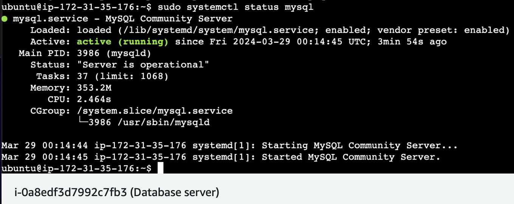

It’s recommended that you run a security script that comes pre-installed with MySQL. This script will remove some insecure default settings and lock down access to your database system.

Open up MYSQL Prompt

```
sudo mysql
```

Then run the following **ALTER USER** command to change the root user’s authentication method to one that uses a password. The following example changes the authentication method to **mysql_native_password**:

```
ALTER USER 'root'@'localhost' IDENTIFIED WITH mysql_native_password BY 'password';
```

After making this change, exit the MySQL prompt:

```
exit
```

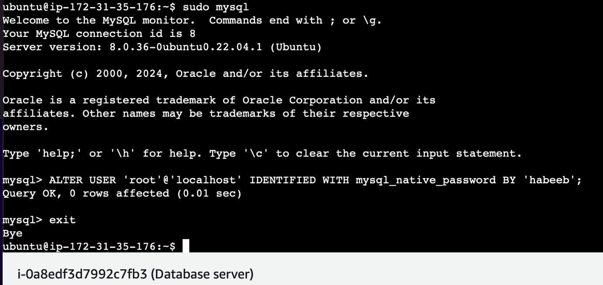

Start the interactive script by running:

```
sudo mysql_secure_installation
```

This will ask if you want to configure the **VALIDATE PASSWORD PLUGIN**.

Note: Enabling this feature is something of a judgment call. If enabled, passwords which don’t match the specified criteria will be rejected by MySQL with an error. It is safe to leave validation disabled, but you should always use strong, unique passwords for database credentials.

When prompted, confirm installation by typing Y, and then ENTER to series of question regarding removal of anonymous user and test database.

### Step 15 - Create a MySQL Database and User (Database Server):

Connect to the MySQL server using the following command, replacing password with the actual root password you set:

```
sudo mysql -u root -p
```

Inside the MySQL shell, create a database named `wordpress` to store your WordPress website data:

```
CREATE DATABASE wordpress;
```

Create a MySQL user named `wordpress` who can access the `wordpress` database. Replace `Password01@` with a secure password of your choice:

```
CREATE USER `wordpress`@`%` IDENTIFIED BY 'habeebops';
```

Grant all privileges on the `wordpress` database to the `wordpress` user:

```
GRANT ALL ON wordpress.* TO 'wordpress'@'%';
```

Flush privileges to ensure changes take effect:

```
FLUSH PRIVILEGES;
```

View databases to verify the creation of the wordpress database:

```
SHOW DATABASES;
```

Exit the MySQL shell:

```
exit
```

### Step 16 - Configure MySQL Bind Address and Restart MySQL Service (Database Server):

By default, MySQL might only listen on localhost connections. To allow access from the web server, edit the MySQL configuration file:

```
sudo nano /etc/mysql/mysql.conf.d/mysqld.cnf
```

Find the line bind-address = 127.0.0.1 and either comment it out or replace it with bind-address = 0.0.0.0. The latter allows connections from any IP address, which is suitable for development purposes but use caution in a production environment. Consider restricting access to the web server's IP for improved security.

Save and close the file.

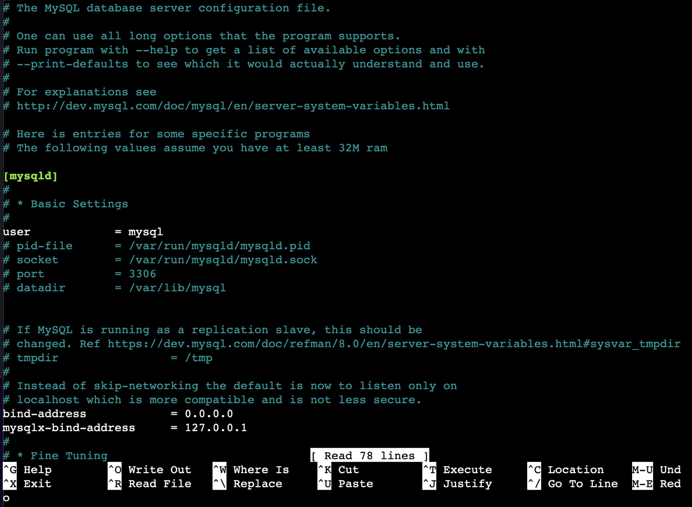

Restart mysql with
```
sudo systemctl restart mysql
```


### Step 17 - Install MySQL Client on Web Server and Test connection from the Web Server: 

To manage MySQL databases directly from the web server instance, install the MySQL client package:

```
sudo apt install mysql-client -y
```

Try connecting to the MySQL server from the web server using the mysql command, replacing with the database server's IP address and the credentials created:

```
sudo mysql -h <database_server_ip> -u wordpress -p
```

If the connection is successful, you'll be prompted for the password and see the MySQL prompt. This confirms that the web server can communicate with the database server.

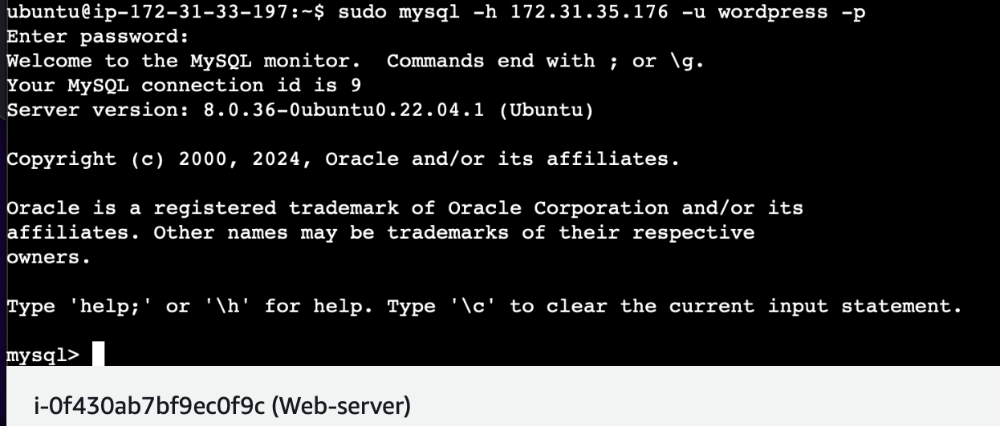

Exit the MySQL shell if you connected for testing:

```
exit
```

Reminder: Make sure port 80 (HTTP) is open in the web server's security group to allow incoming web traffic.

### Step 18 -  Install and Configure WordPress (Web Server):

Update Package lists:

```
sudo apt update
```

Install Apache web server and PHP dependencies:

```
sudo apt install software-properties-common apt-transport-https -y
```

Add the PPA
```
sudo add-apt-repository ppa:ondrej/php -y
```

Now to install PHP 8.1 FPM and it's modules
```
sudo apt install php8.1-fpm php8.1-common php8.1-mysql php8.1-xml php8.1-xmlrpc php8.1-curl php8.1-gd php8.1-imagick php8.1-cli php8.1-dev php8.1-imap php8.1-mbstring php8.1-opcache php8.1-soap php8.1-zip php8.1-intl php8.1-bcmath
```
```
sudo apt install apache2 \
                 ghostscript \
                 libapache2-mod-php \
                 mysql-server \
                 php \
                 php-bcmath \
                 php-curl \
                 php-imagick \
                 php-intl \
                 php-json \
                 php-mbstring \
                 php-mysql \
                 php-xml \
                 php-zip
```

Start and enable the Apache service to ensure it runs at boot time:

```
sudo systemctl start apache2
```
```
sudo systemctl enable apache2
```

Create a directory to hold the downloaded WordPress files:

```
sudo mkdir wordpress
```
```
cd wordpress
```

### Step 19 -  Download and Extract Wordpress (Web Server):

Download the latest WordPress tarball:

```
sudo wget http://wordpress.org/latest.tar.gz
```
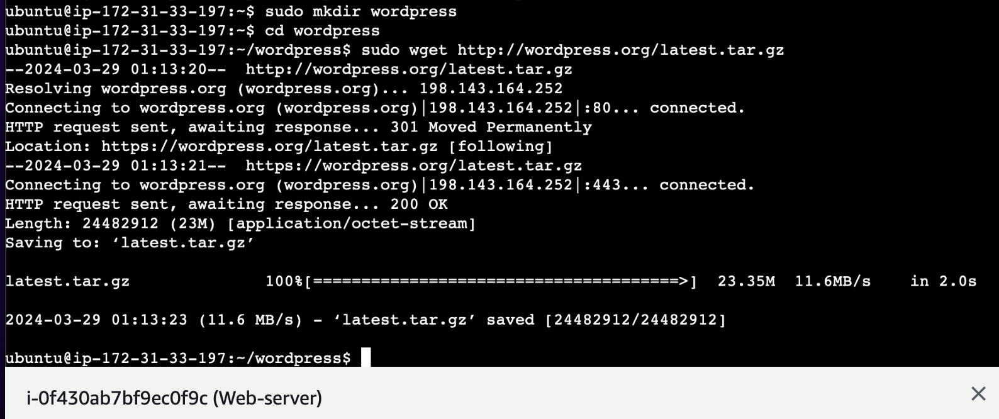

Extract the downloaded archive:

```
sudo tar -xzvf latest.tar.gz
```

Remove the downloaded archive to save space:

```
sudo rm -rf latest.tar.gz
```

- Copy the WordPress configuration file `(wp-config-sample.php)` to `wp-config.php` and configure it according to your MySQL database details:

```
sudo cp wordpress/wp-config-sample.php wordpress/wp-config.php
```


- Copy the entire WordPress directory structure to the web server's document root (/var/www/html):

```
sudo cp -R wordpress /var/www/html/
```

- To ensure Apache has write access to the WordPress directory, change ownership to the Apache user:

```
sudo chown -R www-data:www-data /var/www/html/wordpress
```

- Restart the Apache web server to apply any configuration changes and make WordPress accessible:

```
sudo systemctl restart apache2
```

### Step 20 - Access WordPress Admin Panel:

- Open a web browser and navigate to the public IP address or domain name of your web server instance, followed by /wordpress/wp-admin. You should see the WordPress login screen.

- Use the MySQL username `(wordpress)` and password you created earlier to log in to the WordPress admin panel and complete the setup process.

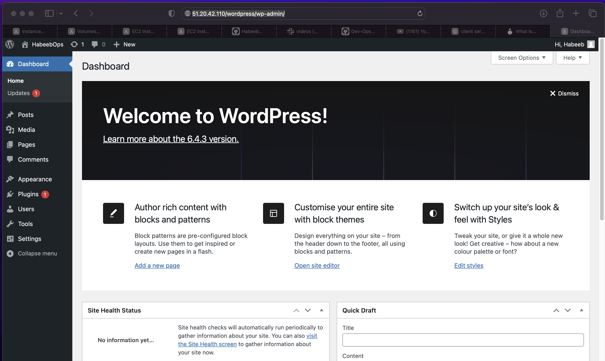


### Conclusion:

The web solution with WordPress has been successfully deployed on Ubuntu servers hosted on Amazon EC2 instances. The web server communicates with the MySQL database server, and users can access the WordPress site from their browsers.
By following these comprehensive steps, you should have a fully functional WordPress website running on your Ubuntu EC2 instances, ensuring reliability and scalability for your web solution.

**PROJECT COMPLETED** 